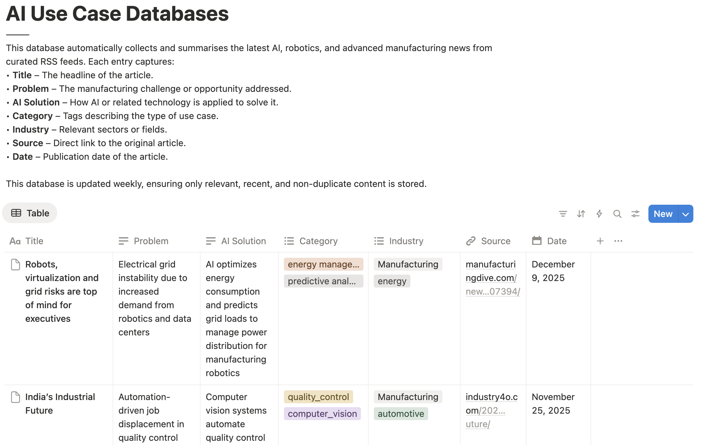

# 🚀 AI Manufacturing Digest

A GitHub Actions workflow that automatically fetches, summarizes, and saves the latest AI and manufacturing news to Notion.

---

## 📷 Demo

Here’s a demo of the AI Manufacturing Digest in action:

---

## 📡 Features

- Aggregates news from multiple manufacturing and AI-related RSS feeds.
- Filters articles based on relevance, publication date, and duplicates.
- Uses an LLM (via OpenRouter API) to extract AI use cases or summarize articles.
- Automatically adds processed summaries to a Notion database.
- Runs on a daily schedule or manually via workflow dispatch.
- Gracefully handles feed errors or LLM failures to avoid workflow crashes.

---

## 📡 RSS Feeds

Some of the feeds included:
 - Industry 4.0
 - Manufacturing Dive
 - VentureBeat AI
 - IEEE Spectrum Robotics
 - Automation World
 - Robotics Business Review
 - IoT For All
 - Plus 15+ more industrial and AI news sources.

(You can customize or expand this list in summarize.py)

---

## 🛠️ Setup

### 1. Clone the repo
git clone https://github.com/yourusername/ai-manufacturing-digest.git
cd ai-manufacturing-digest

## 2. Set up GitHub secrets

Go to your repository Settings → Secrets → Actions and add:
 - OPENROUTER_KEY – Your OpenRouter API key
 - NOTION_TOKEN – Your Notion integration token
 - NOTION_DATABASE_ID – The database ID where summaries will be saved

## 3. Python Dependencies

The workflow installs dependencies automatically, but you can also run locally:
pip install feedparser requests beautifulsoup4

---

## 🏃 Running the Workflow

Manual run
 - Go to the Actions tab on GitHub.
 - Select the AI Manufacturing Digest workflow and click Run workflow.

Scheduled run
 - The workflow runs daily at 15:00 UTC by default (cron: '0 15 * * *').
 - You can adjust the schedule in .github/workflows/ai-manufacturing-digest.yml.

---

## 🔧 Workflow Steps

1. Checkout repository
2. Install Python (3.10)
3. Install dependencies (feedparser, requests, beautifulsoup4)
4. DNS check for OpenRouter API (helps catch network issues early)
5. Run summarize.py to process feeds and add entries to Notion

---

## ⚠️ Troubleshooting

1. LLM connection errors: Failed to resolve 'api.openrouter.ai' 
 - Check internet connectivity or DNS.
 - Make sure your OpenRouter API key is valid.
 - Retry later if hitting rate limits (429 errors).
2. Older articles skipped: By default, articles older than 7 days are ignored. Adjust this in summarize.py.
3. Duplicate or irrelevant articles: Skipped automatically.

---

## 📝 Customization
 - Add or remove RSS feeds in summarize.py under the feeds list.
 - Change relevance rules or keywords in summarize.py.
 - Modify Notion database structure to include custom properties (title, summary, link, date, etc.).

---

## 📦 Requirements
 - Python 3.10+
 - GitHub repository with Actions enabled
 - Notion account with integration access
 - OpenRouter API key (or other LLM endpoint)

## 🔗 References
 - Notion API
 - OpenRouter API
 - GitHub Actions documentation
