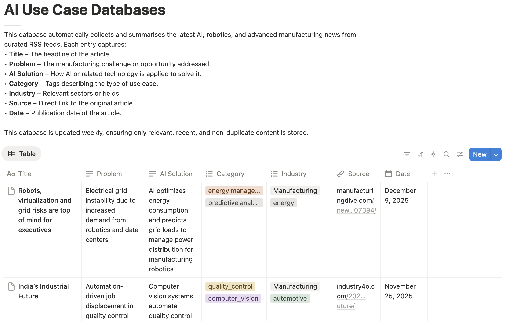

# 🚀 AI Manufacturing Digest

A GitHub Actions workflow that fetches manufacturing and AI news each week, extracts concrete
AI use cases with an LLM, and files them into a Notion database.

[View the Notion table →](https://chrome-delphinium-9f8.notion.site/2c2cff9b36e98009a47ac7c472ee795e?v=2c2cff9b36e980e2b250000c504c20ee)



---

## 📡 How it works

1. Pulls entries from 18 RSS feeds (manufacturing, robotics, and AI press).
2. Drops anything older than 7 days, already in Notion, or failing the relevance gate.
3. **Fetches the full article body** — not just the RSS excerpt — and sends that to the model.
4. Asks the model for a specific problem / solution pair, or to skip the article entirely.
5. Snaps the returned tags onto a controlled vocabulary and writes the row to Notion.

Runs **Monday and Thursday at 15:00 UTC**, or on demand via **Actions → Run workflow**.

---

## 🛠️ Setup

Add three repository secrets under **Settings → Secrets and variables → Actions**:

| Secret | What it is |
|---|---|
| `OPENROUTER_KEY` | OpenRouter API key |
| `NOTION_TOKEN` | Notion internal integration token |
| `NOTION_DATABASE_ID` | Target Notion database ID |

The Notion database needs these properties: `Title` (title), `Problem` (text),
`AI Solution` (text), `Category` (multi-select), `Industry` (multi-select),
`Source` (url), `Date` (date).

Optionally add `Stage` (select) to record how far along each use case is — `Deployed`,
`Pilot` or `Announced`. The script reads the schema at startup and writes the field only when
the column exists, so it can be added at any time without touching the code.

Run locally with:

```bash
pip install -r requirements.txt
OPENROUTER_KEY=... NOTION_TOKEN=... NOTION_DATABASE_ID=... python app.py
```

---

## 🤖 Model selection

The digest uses free OpenRouter models. **Free models get retired without notice** — this is
what silently broke the pipeline for months when `tngtech/deepseek-r1t2-chimera:free`
disappeared and every request began returning 404.

`resolve_models()` returns a *pool*, not a single choice: it queries the live catalogue at
startup, orders it by `PREFERRED_MODELS`, and appends any other capable free model.

A pool is necessary because being listed only means a model exists. A free model still returns
`404 no endpoints` when no provider is currently serving it, which happened mid-run on
2026-08-10. `call_llm()` falls through the pool and drops a model with no provider for the rest
of the run, rather than retrying it on every article.

---

## ⏱️ Working within the free tier

This project runs on free OpenRouter models only, which allow roughly **50 requests per day**.
That is a hard design constraint, not a temporary state, so the pipeline budgets its calls.

A typical week yields ~140 articles, which the free filters reduce to **~17 candidates** —
comfortably inside the quota. `MAX_LLM_CALLS` (default **25**) caps a run regardless, so no
single run can exhaust the day's allowance.

When candidates exceed the budget, they are ranked by `deployment_score()` and the best ones
are analysed first. The score is computed from the title and RSS excerpt at no cost, and
rewards concrete figures (percentages, hours, tons), deployment verbs ("deploys", "cuts",
"automates"), and named AI techniques, while penalising announcement language ("launches",
"partners", "plans to"). Candidates left unanalysed are counted as `Over budget` in the
summary.

Ranking is why candidates are gathered from every feed *before* any analysis begins.
Processing feed-by-feed would let the first feeds spend the whole budget, and the feeds at the
end of the list would never be analysed at all.

Two runs a day is the practical ceiling. For cheap iteration, run with a small budget:

```bash
MAX_LLM_CALLS=3 DRY_RUN=1 python app.py
```

Both are exposed as `workflow_dispatch` inputs. When the quota is gone the run aborts after
three consecutive failures rather than grinding through every feed, and reports
`LLM unavailable` — never `no usable use case`.

---

## 🔔 Failure behaviour

The first version caught every exception and always exited 0, so Actions reported a green
tick every Monday while adding zero rows to Notion. That is no longer possible — the run
exits non-zero when:

- a required secret is missing
- no usable model can be resolved
- the model was unavailable for at least half the analysed articles
- every Notion write failed
- more than half the feeds returned nothing

A model outage is counted and reported separately from an article the model declined.
Collapsing the two is how "the API is down" disguises itself as "nothing newsworthy this
week" — analysing articles and adding none is a warning, not a failure, because a quiet week
is plausible; being unable to reach the model never is.

Each run ends with a summary table (seen / skipped / analysed / added) so a silent drift to
zero is visible at a glance.

---

## 🏷️ Tag hygiene

`Category` and `Industry` are restricted to short controlled vocabularies defined at the top
of `app.py` — **11 categories and 13 industries**. The model picks from those lists, and
`snap_tags()` folds anything off-list onto the right one via `CATEGORY_ALIASES` /
`INDUSTRY_ALIASES`, or drops it.

The lists are deliberately short and describe what the AI is *for*, not which technique it
uses — the technique belongs in the `AI Solution` text, where it can be stated precisely. A
long list fragments the table: when three tags are all plausible for one article, no two rows
tag alike and filtering by Category stops meaning anything.

This exists because free-form tagging had grown the database to 65 `Category` and 51
`Industry` options full of near-duplicates — `predictive_maintenance` vs
`Predictive Maintenance`, `computer vision` vs `computer_vision`. New rows are consistent;
the historical options can be merged in Notion at your convenience.

Fuzzy matching uses a 0.92 cutoff, not a looser one. These terms differ by a single
distinguishing word, so a low threshold compares mostly the shared remainder and conflates
opposites: `adaptive manufacturing` scored 0.909 against `Additive Manufacturing`. Real typos
score above 0.93. Fuzzy matching should forgive spelling, never substitute a concept.

---

## 📝 Customising

- **Feeds** — edit `FEEDS`. Dead feeds are reported in the run summary rather than ignored.
- **Vocabulary** — edit `CATEGORIES` / `INDUSTRIES`; the prompt is built from them.
- **Strictness** — the skip rules live in the prompt inside `extract_use_case()`.
- **Window** — `LOOKBACK_DAYS` (default 7; runs twice weekly, so entries overlap deliberately).
- **Cadence** — the `schedule` cron in the workflow. Keep runs on separate days: each needs
  ~25 model calls against a ~50/day quota.

---

## 📦 Requirements

Python 3.12, GitHub Actions, a Notion integration with access to the target database, and an
OpenRouter API key.
